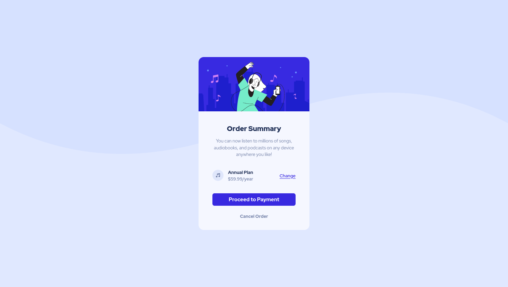

# Frontend Mentor - Order summary card solution

This is a solution to the [Order summary card challenge on Frontend Mentor](https://www.frontendmentor.io/challenges/order-summary-component-QlPmajDUj).

## Table of contents

- [Overview](#overview)
  - [The challenge](#the-challenge)
  - [Screenshot](#screenshot)
  - [Links](#links)
- [My process](#my-process)
  - [Built with](#built-with)
  - [What I learned](#what-i-learned)
  - [Continued development](#continued-development)
  - [Useful resources](#useful-resources)
- [Author](#author)
- [Acknowledgments](#acknowledgments)

## Overview

### The challenge

1. To build out [Order summary card challenge on Frontend Mentor](https://www.frontendmentor.io/challenges/order-summary-component-QlPmajDUj) and get it looking as close to the design as possible.

2. Users should be able to:

   - See hover states for interactive elements

### Screenshot



### Links

- The frontend mentor [solution](https://your-solution-url.com)
- The project [ live preview](https://jos-me.github.io/order-summary-component/)

## My process

### Built with

- Semantic HTML5 markup
- CSS custom properties
- Flexbox
- Desktop-first workflow
- BEM naming comversion

### What I learned

While building the projects, I learn how i can define and reuse CSS custom properties, such as defining the color palette and typography. For example, The below approach help me use the color by their role as well as original color whenever needed.

```css
/* Colors */

--color-pale-blue: hsl(225, 100%, 94%);
--color-bright-blue: hsl(245, 75%, 52%);
--color-very-pale-blue: hsl(225, 100%, 98%);
--desaturated-blue: hsl(224, 23%, 55%);
--dark-blue: hsl(223, 47%, 23%);
--color-white: hsl(0, 0%, 100%);

--color-primary: var(--color-bright-blue);
--color-secondary: var(--color-pale-blue);
--color-accent: var(--color-very-pale-blue);
--color-headings: var(--dark-blue);
--color-text: var(--desaturated-blue);
```

### Continued development

- For future projects I will need to work more on [BEM Methodology](https://en.bem.info/methodology/).

- Also, I'm planning to learn and use [OOCSS](http://oocss.org/) in my next project.

### Useful resources

- [BEM 101](https://css-tricks.com/bem-101/)
- [Creating clean CSS with BEM methodology](https://www.devbridge.com/articles/implementing-clean-css-bem-method/)
- [A Complete Guide to Custom Properties ](https://css-tricks.com/a-complete-guide-to-custom-properties/)
- [Create your design system, part 3: Colors](https://medium.com/codyhouse/create-your-design-system-part-3-colors-798e4729921f)

## Author

- Frontend Mentor - [@jos-me](https://www.frontendmentor.io/profile/jos-me)
- Twitter - [@py4fun](https://www.twitter.com/yourusername)
